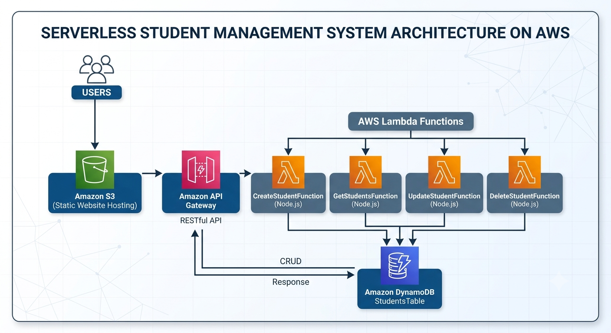

# Serverless Student Management System

A fully serverless CRUD (Create, Read, Update, Delete) web application built using AWS services and Node.js.

This project demonstrates how to build a scalable serverless application using Amazon S3, API Gateway, AWS Lambda, and DynamoDB without managing any servers.

---

## Project Overview

The Student Management System allows users to:

- Add new students
- View student records
- Update student information
- Delete student records

The application follows a serverless architecture where all backend operations are handled by AWS managed services.

---

## Architecture

## Architecture



## AWS Services Used

### Amazon S3

Purpose:

- Hosts frontend static files
- Stores HTML, CSS, and JavaScript files
- Provides static website hosting

Benefits:

- Highly available
- Low cost
- No server management

---

### Amazon API Gateway

Purpose:

- Creates RESTful API endpoints
- Routes HTTP requests to Lambda functions

Endpoints:

- GET /students
- POST /students
- PUT /students
- DELETE /students

Benefits:

- Fully managed API service
- Supports CORS
- Secure and scalable

---

### AWS Lambda

Purpose:

- Executes backend business logic
- Processes CRUD operations

Functions Created:

1. GetStudents
2. CreateStudent
3. UpdateStudent
4. DeleteStudent

Benefits:

- No server management
- Pay only for execution time
- Auto scaling

---

### Amazon DynamoDB

Purpose:

- Stores student records

Table:

Students

Partition Key:

id (Number)

Sample Record:

```json
{
  "id": 1,
  "name": "Akshay",
  "course": "AWS Developer"
}
```

Benefits:

- Fully managed NoSQL database
- High performance
- Automatic scaling

---

## Technologies Used

### Frontend

- HTML5
- CSS3
- JavaScript

### Backend

- Node.js
- AWS SDK v3

### Cloud Services

- Amazon S3
- AWS Lambda
- Amazon API Gateway
- Amazon DynamoDB

---

## Project Folder Structure

```text
student-crud/
│
├── student-crud-frontend/
│   ├── index.html
│   ├── app.js
│   └── style.css
│
├── lambda/
│   ├── CreateStudent.js
│   ├── GetStudents.js
│   ├── UpdateStudent.js
│   └── DeleteStudent.js
│
└── README.md
```

---

## API Endpoints

### Create Student

Method:

```http
POST /students
```

Request Body:

```json
{
  "id": 1,
  "name": "Akshay",
  "course": "AWS Developer"
}
```

---

### Get Students

Method:

```http
GET /students
```

Response:

```json
[
  {
    "id": 1,
    "name": "Akshay",
    "course": "AWS Developer"
  }
]
```

---

### Update Student

Method:

```http
PUT /students
```

Request Body:

```json
{
  "id": 1,
  "name": "Akshay Dhongade",
  "course": "Cloud Engineer"
}
```

---

### Delete Student

Method:

```http
DELETE /students
```

Request Body:

```json
{
  "id": 1
}
```

---

## DynamoDB Operations Used

### Create

```javascript
PutCommand;
```

Purpose:

Adds a new item to DynamoDB.

---

### Read

```javascript
ScanCommand;
```

Purpose:

Retrieves all student records.

---

### Update

```javascript
UpdateCommand;
```

Purpose:

Updates existing student information.

---

### Delete

```javascript
DeleteCommand;
```

Purpose:

Deletes a student record.

---

## Security Considerations

- IAM Roles used for Lambda execution
- Principle of least privilege followed
- No hardcoded AWS credentials
- API Gateway CORS configuration enabled

---

## Challenges Faced During Development

### Lambda Runtime Issue

Error:

```text
require is not defined in ES module scope
```

Solution:

Used ES Module syntax:

```javascript
import
```

instead of

```javascript
require;
```

---

### DynamoDB Region Mismatch

Error:

```text
ResourceNotFoundException
```

Solution:

Created DynamoDB table in the same AWS region as Lambda.

---

### IAM Permission Issues

Error:

```text
AccessDeniedException
```

Solution:

Attached appropriate DynamoDB permissions to Lambda execution role.

---

### CORS Issues

Error:

```text
Blocked by CORS policy
```

Solution:

- Configured API Gateway CORS settings
- Added CORS headers in Lambda responses
- Enabled OPTIONS method support

---

## Key Learning Outcomes

Through this project, I gained practical experience with:

- Serverless Architecture
- AWS Lambda
- API Gateway
- DynamoDB
- S3 Static Website Hosting
- IAM Roles and Permissions
- AWS SDK v3
- REST APIs
- CORS Configuration
- Cloud-Based CRUD Applications

---

## Future Enhancements

- User Authentication using Amazon Cognito
- File Upload using Amazon S3
- CloudFront CDN Integration
- Infrastructure as Code using Terraform
- CI/CD Pipeline using GitHub Actions
- Monitoring with Amazon CloudWatch
- Custom Domain using Route 53

---

## Author
Akshay Dhongade

AWS Cloud Engineer | DevOps Engineer| Full Stack Developer

GitHub: https://github.com/asdweb22

LinkedIn: https://linkedin.com/in/iamakshaydhongade
